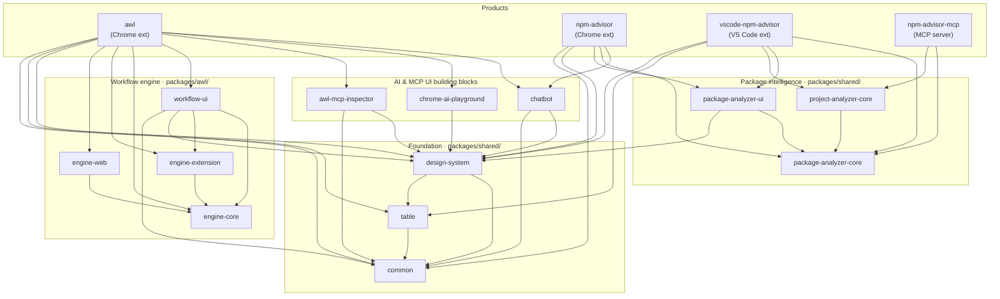

# **🦉 Agentic Web Labs (AWL)**

**An open-source Chrome Extension for learning, exploring, and experimenting with the technologies of the Agentic Web.**

The web is undergoing a paradigm shift. AI agents are emerging as a new class of user — autonomous, goal-driven, and capable of acting on behalf of people to plan, coordinate, and execute complex tasks. This transition introduces a wave of new technologies, protocols, and challenges that web developers need to understand.

AWL is a hands-on learning companion built to help you navigate this shift. It provides interactive environments where you can experiment with [MCP](https://modelcontextprotocol.io/) servers, discover a page's [WebMCP](https://developer.chrome.com/blog/webmcp-epp) tools, test Chrome's [Built-in AI APIs](https://developer.chrome.com/docs/ai/built-in), and see how AI agents interact with the browser — all from within Chrome, alongside the web pages you're already working with.

---

## **The Agentic Web**

We're at the transition point between the web as we know it and an **Agentic Web** where websites evolve from single-interface entities serving HTML to humans, into **dual-interface platforms** that also expose structured context and capabilities to AI agents via standardized protocols.

This landscape is complex and fast-moving. It spans new platform capabilities (agentic browsers, built-in AI), new infrastructure (MCP, agent-to-agent protocols, development frameworks), trust and safety challenges (prompt injection, agent identity, privacy), and entirely new economic models.

AWL is designed to make this landscape concrete for developers who are wrapping their heads around web development in the agentic AI era, giving them a structured way to learn key technologies by interacting with them directly.

### **Who is AWL for?**

- **Web developers** looking to understand how to make their sites and apps agent-ready.  
- **Researchers and engineers** exploring how LLMs interact with browser environments through protocols like MCP.  
- **Learners** seeking a guided, hands-on way to grasp the scope and components of the Agentic Web.

---

## **What You Can Do with AWL**

### **💬 Chat with AI Models in the Browser**

AWL provides a side-panel chat interface where you can converse with configurable AI models — both cloud-hosted foundation models and Chrome's on-device Gemini Nano — while giving those models the ability to **act**: reading web pages, calling browser APIs, invoking remote MCP servers, and executing automation scripts, all from within the browser tab you're already looking at.

Through the chat interface AWL orchestrates the interaction of AI agents with web content, making every action fully transparent. Tool invocations render as expandable cards showing input arguments, JSON responses, and execution timing. Reasoning-capable models display their chain-of-thought before answering.

| Provider | Models |
| :---- | :---- |
| Anthropic | Claude family |
| Google | Gemini family |
| OpenAI | GPT family |
| Chrome Built-in | Gemini Nano (on-device) |

### **🔌 Connect to and Inspect MCP Servers**

The [Model Context Protocol (MCP)](https://modelcontextprotocol.io/) is the emerging standard for how AI agents connect to external systems. AWL lets you:

- **Connect to any MCP server** via SSE, Streamable HTTP, or Stateless HTTP — with optional OAuth, custom headers, and domain filtering  
- **Inspect server capabilities** — browse discovered tools, view their schemas, and understand what each server exposes  
- **Test tools manually** — execute any registered tool with custom inputs and see raw JSON results, independent of the chat flow  
- **Debug MCP communication** — a real-time event log shows tool calls, registrations, and transport-level messages as they happen

This gives you direct visibility into the layer of communication that powers agent-server interactions — helping you understand MCP in practice, not just in theory.

### **🌐 Explore WebMCP — How Pages Expose Tools to Agents**

[WebMCP](https://developer.chrome.com/blog/webmcp-epp) enables web pages to register tools on `navigator.modelContext`, making page-level functionality discoverable and callable by AI agents. AWL lets you explore this concept hands-on:

- **Discover page-registered tools** — see what tools a WebMCP-enabled page exposes to agents  
- **Author custom WebMCP scripts** — use the built-in code editor (with syntax highlighting and live validation) to create your own tools that agents can call on specific pages  
- **Understand the tool execution flow** — watch how requests travel from the agent, through the extension's service worker, into the content script, and down to the page context where the tool runs

This is where the "websites as first-class citizens of the Agentic Web" concept becomes tangible — you can see exactly how a page communicates its capabilities to an AI agent.

### **🧪 Experiment with Chrome's Built-in AI APIs**

Chrome is bringing on-device AI capabilities directly into the browser. AWL provides sandboxed **API Playgrounds** where you can experiment with each API in isolation — learning parameters, observing behavior, and understanding what's possible before writing production code:

- **Prompt Lab** — free-form prompting against Gemini Nano (Prompt API)  
- **Writer's Studio** — content generation and refinement (Writer & Rewriter APIs)  
- **Summarization Station** — text summarization with configurable strategies (Summarizer API)  
- **Polyglot Panel** — translation and language detection (Translator & Language Detector APIs)  
- **Proofreader** — spelling and grammar checking (Proofreader API)

### **🔀 Build Workflows with the Built-in AI Workflow Composer**

Go beyond individual APIs. The **Workflow Composer** is a visual, node-based editor where you can chain multiple Built-in APIs together into agentic workflows:

- Drag nodes onto a canvas, connect them with edges, and configure parameters  
- All processing happens **locally on your machine** — no data leaves the browser  
- Completed workflows are automatically exposed as **callable MCP tools**, bridging the visual editor and the chat interface

This lets you prototype multi-step AI pipelines and understand how on-device capabilities compose together — before writing a single line of production code.

### **🛠️ Debug with the AWL DevTools Panel**

A dedicated **AWL** tab in Chrome DevTools that gives you deep visibility into the agentic layer:

- **Tool List** — all MCP tools registered for the current tab, with full JSON schema details  
- **Run Tool** — manually execute any tool with custom input parameters  
- **Events** — real-time log of MCP communication (tool calls, results, registrations, transport messages)

### **📝 Create Prompt Commands**

Define custom slash commands — reusable prompt shortcuts for the chat interface that speed up common interactions with the agent.

---

## **Learning Areas**

AWL unifies tools from multiple sources under a single MCP-based interface, giving you visibility into how agents discover and use capabilities from different layers of the web stack:

| Tool Source | What it teaches you |
| :---- | :---- |
| **Chrome API tools** | How agents interact with browser capabilities (DOM, tabs, history, storage) |
| **WebMCP page tools** | How websites expose functionality to agents via `navigator.modelContext` |
| **External MCP servers** | How agents connect to remote services via standardized protocols |
| **Workflow tools** | How composed AI pipelines become callable capabilities |
| **Custom user scripts** | How to author your own agent-callable tools |

---

## **Getting Started**

### **Prerequisites**

- **Git**  
- **Node.js** via [nvm](https://github.com/nvm-sh/nvm) (the repo provides an `.nvmrc` with the required version)  
- **pnpm** \>= 10

### **1\. Clone and set up Node**

```shell
git clone https://github.com/amedina/agentic-web-labs.git
cd agentic-web-labs

nvm install
nvm use
```

### **2\. Install pnpm**

```shell
npm install -g pnpm
pnpm -v   # verify >= 10
```

### **3\. Install dependencies and build**

```shell
pnpm install
pnpm build
```

### **4\. Load the extension in Chrome**

1. Navigate to `chrome://extensions`  
2. Enable **Developer mode** (toggle in the top-right corner)  
3. Click **Load unpacked**  
4. Select the `dist/awl` directory

### **5\. Development mode (optional)**

```shell
pnpm dev
```

Starts the build in watch mode — changes are reflected in `dist/awl` automatically. Reload the extension in Chrome to pick them up.

**Note:** Some features (like custom WebMCP tools) require the **User Scripts** permission. After loading the extension, go to `chrome://extensions`, find AWL, and enable "User Scripts" in its details page.

---

## **Configuration**

Click the AWL icon in the Chrome toolbar to open the side panel. Use the **Options page** to configure:

| Section | Purpose |
| :---- | :---- |
| **Models** | Configure AI provider API keys, thinking mode, system prompts |
| **MCP → MCP Servers** | Connect to external MCP servers for exploration |
| **MCP → WebMCP Tools** | Author and manage custom browser-side tools |
| **MCP → MCP Inspector** | Debug and inspect MCP server connections |
| **Built-in AI → API Status** | Check which Chrome on-device APIs are available |
| **Built-in AI → API Playgrounds** | Experiment with individual Built-in AI APIs |
| **Built-in AI → Workflow Composer** | Build and run visual AI workflows |
| **Prompt Commands** | Define custom slash commands for the chat |
| **Settings** | Theme (light/dark/auto) and log level |

---

## **Tech Stack**

- **TypeScript** \+ **React 19**  
- **Vercel AI SDK** (`ai`) — multi-provider model abstraction  
- **@assistant-ui/react** — chat interface framework  
- **@modelcontextprotocol/sdk** — MCP server/client implementation  
- **@xyflow/react** (React Flow) — visual workflow editor  
- **Chrome Extension APIs** (Manifest V3) — side panel, tabs, storage, scripting, devtools  
- **pnpm workspaces** — monorepo management

---

## **Repository Structure**

AWL is a [pnpm workspace](https://pnpm.io/workspaces) monorepo. All code lives under `packages/`, grouped by role, with reusable libraries in `packages/shared/` and shippable products in `packages/extensions/` and `packages/mcp/`.

```
agentic-web-labs/
├── packages/
│   ├── awl/                        # Building blocks specific to the AWL extension
│   │   ├── engine-core/            # Environment-agnostic workflow execution engine
│   │   ├── engine-extension/       # Chrome-extension runtime adapter for the engine
│   │   ├── engine-web/             # Plain-web-page runtime adapter for the engine
│   │   ├── workflow-ui/            # Visual drag-and-drop workflow editor (React Flow)
│   │   └── chrome-ai-playground/   # React UI for testing Chrome's Built-in AI APIs
│   ├── extensions/                 # Shippable browser / editor extensions
│   │   ├── awl/                    # 🦉 Flagship Agentic Web Labs Chrome extension
│   │   ├── npm-advisor/            # npm package-intelligence Chrome extension
│   │   └── vscode/                 # NPM Advisor VS Code extension
│   ├── mcp/                        # Model Context Protocol packages
│   │   ├── awl-mcp-inspector/      # Embeddable React MCP inspector UI
│   │   └── npm-advisor-mcp/        # MCP server exposing npm package intelligence
│   └── shared/                     # Reusable libraries shared across packages
│       ├── common/                 # Foundational utils, types, React context helpers
│       ├── design-system/          # React component library (Radix UI + Tailwind)
│       ├── table/                  # Feature-rich data table component
│       ├── chatbot/                # Multi-provider AI chat UI with MCP tool calling
│       ├── package-analyzer-core/  # npm fitness / security / license / bundle analysis
│       ├── package-analyzer-ui/    # React UI for package analysis
│       ├── project-analyzer-core/  # publint + replacement + circular-dependency analysis
│       ├── shared-config/          # Centralized ESLint / Jest / Prettier / TS / Tailwind config
│       └── storybook-config/       # Centralized Storybook host
├── skills/                         # Agent skills (chrome-ai, web-compat-audit, webmcp-builder)
├── bin/                            # Shell scripts (install, local deploy, Chrome launcher)
├── patches/                        # pnpm patches applied to upstream dependencies
└── docs/                           # Repository documentation
```

---

## **Packages**

Every package is namespaced `@agentic-web-labs/*` (the VS Code extension is published as `vscode-npm-advisor`). Click a package name for its own README.

### Shared libraries — `packages/shared/`

The reusable foundation other packages build on.

| Package | Kind | Description |
| :---- | :---- | :---- |
| [common](packages/shared/common/README.md) | Library | Foundational utilities, shared types, constants, and a re-render-suppressing React context selector |
| [design-system](packages/shared/design-system/README.md) | UI kit | React component library built on Radix UI + Tailwind, plus agentic/MCP-specific components |
| [table](packages/shared/table/README.md) | UI kit | Data table with sorting, filtering, search, column resizing, and persistent settings |
| [chatbot](packages/shared/chatbot/README.md) | UI kit | Embeddable chat UI with multi-provider AI (Anthropic/OpenAI/Gemini/Gemini Nano) and MCP tool calling |
| [package-analyzer-core](packages/shared/package-analyzer-core/README.md) | Library | Fetches and scores npm package fitness, security advisories, license, and bundle size |
| [package-analyzer-ui](packages/shared/package-analyzer-ui/README.md) | UI kit | React UI for package analysis, decoupled from any host via a `StatsClient` adapter |
| [project-analyzer-core](packages/shared/project-analyzer-core/README.md) | Library | Runs publint, replacement-opportunity, and circular-dependency analyses over a project |
| [shared-config](packages/shared/shared-config/README.md) | Config | Centralized ESLint, Jest, Playwright, Prettier, Tailwind, and TypeScript configurations |
| [storybook-config](packages/shared/storybook-config/README.md) | Config | Single Storybook host aggregating stories across packages |

### AWL building blocks — `packages/awl/`

| Package | Kind | Description |
| :---- | :---- | :---- |
| [engine-core](packages/awl/engine-core/README.md) | Library | Environment-agnostic engine that parses, validates, and executes node-graph workflows |
| [engine-extension](packages/awl/engine-extension/README.md) | Library | Chrome-extension runtime adapter wiring the engine to service worker, content script, and UI |
| [engine-web](packages/awl/engine-web/README.md) | Library | Browser-native runtime adapter for running workflows in plain web pages |
| [workflow-ui](packages/awl/workflow-ui/README.md) | UI kit | Visual drag-and-drop workflow editor built on React Flow |
| [chrome-ai-playground](packages/awl/chrome-ai-playground/README.md) | UI kit | Status dashboard and interactive playgrounds for Chrome's Built-in AI APIs |

### Extensions — `packages/extensions/`

| Package | Kind | Description |
| :---- | :---- | :---- |
| [awl](packages/extensions/awl/README.md) | Chrome extension | 🦉 The flagship AWL extension — WebMCP discovery, per-tab MCP server, AI chatbot side panel, workflows, MCP inspector |
| [npm-advisor](packages/extensions/npm-advisor/README.md) | Chrome extension | Scores and AI-chats npm packages while browsing npmjs.com and GitHub |
| [vscode](packages/extensions/vscode/README.md) | VS Code extension | Inline npm package insights, diagnostics, a Copilot chat participant, and MCP setup |

### MCP — `packages/mcp/`

| Package | Kind | Description |
| :---- | :---- | :---- |
| [awl-mcp-inspector](packages/mcp/awl-mcp-inspector/README.md) | UI kit | Embeddable React UI for inspecting, debugging, and interacting with MCP servers |
| [npm-advisor-mcp](packages/mcp/npm-advisor-mcp/README.md) | MCP server | Exposes npm package fitness, security, license, and replacement intelligence to AI clients |

---

## **Architecture**

The dependency graph flows from a shared foundation up through subsystems to four shippable products. Two product families share that foundation: **AWL** (the agentic-web learning extension) and **NPM Advisor** (package intelligence delivered as a Chrome extension, a VS Code extension, and an MCP server).



> Every package also depends on `shared-config` for its tooling; those edges are omitted above for readability.

- **`engine-core`** holds the runtime-agnostic workflow logic; **`engine-extension`** and **`engine-web`** adapt it to the Chrome-extension and plain-web environments respectively, and **`workflow-ui`** is the visual editor on top.
- **`package-analyzer-core`** is the single source of npm package data, reused by its UI (`package-analyzer-ui`), the project-level analyzer (`project-analyzer-core`), and all three NPM Advisor products.
- **`chatbot`**, **`design-system`**, **`common`**, and **`table`** are the cross-cutting UI/utility foundation shared widely across the tree.

---

## **Skills**

The [`skills/`](skills/README.md) directory contains three **agent skills** — self-contained knowledge packs (a `SKILL.md` guide plus reference docs, evaluation cases, and helper scripts) that teach AI agents how to build modern, AI-enhanced web experiences.

| Skill | Directory | What it covers |
| :---- | :---- | :---- |
| **Chrome Built-in AI** | [`skills/chrome-ai/`](skills/README.md) | Six sub-skills — one per Chrome on-device (Gemini Nano) API: Prompt (`LanguageModel`), Summarizer, Writer, Rewriter, Proofreader, and Translator (+ `LanguageDetector`). Each follows the *availability → create → use → destroy* lifecycle. |
| **Web Compatibility Audit** | [`skills/web-compat-audit/`](skills/web-compat-audit/SKILL.md) | A five-stage, non-invasive pipeline auditing a project for cross-browser issues (ESLint `eslint-plugin-compat`, stylelint, `@e18e/cli`, Lighthouse) and rendering a unified HTML report with remediation steps. |
| **WebMCP Builder** | [`skills/webmcp-builder/`](skills/webmcp-builder/SKILL.md) | A guide to building **WebMCP tools** — client-side JS interfaces that expose web-app functionality to AI agents via `navigator.modelContext`, including tool contracts, side-effect annotations, human-in-the-loop gating, and a scaffold script. |

See [`skills/README.md`](skills/README.md) for the full breakdown.

---

## **Monorepo Conventions**

- **Package manager:** [pnpm](https://pnpm.io) `>= 10` is enforced (`preinstall` runs `only-allow pnpm`). Node version is pinned via `.nvmrc` (`v22.19.0`).
- **Workspaces:** declared in `pnpm-workspace.yaml` as `packages/**`. Internal dependencies use the `workspace:*` protocol.
- **Build order:** the root `build` script builds packages in dependency order (`common` → `table` → `chrome-ai-playground` → `awl-mcp-inspector` → `design-system` → `chatbot` → `npm-advisor` → `awl` → `npm-advisor-mcp` → `vscode`). Most libraries compile with `tsc`; the extensions use Vite or esbuild.
- **Shared tooling:** ESLint, Prettier, Jest/Playwright, Tailwind, and TypeScript configs all come from [`shared-config`](packages/shared/shared-config/README.md) — packages extend them rather than maintaining their own.
- **Patches:** upstream dependencies are patched via pnpm `patchedDependencies` (see `patches/`), covering `zod`, `ajv`, the `@mcp-b/*` transports, and `@assistant-ui/react`.
- **Git hooks:** a Husky `pre-commit` hook runs on commit (`prepare: husky`).

### Common root scripts

| Script | What it does |
| :---- | :---- |
| `pnpm build` | Build every package in dependency order |
| `pnpm dev` | Run the AWL extension in watch mode (alias for `dev:awl`) |
| `pnpm lint` / `pnpm format` | Lint / format across packages |
| `pnpm test:*` | Per-package test runners (e.g. `test:awl`, `test:design-system`, `test:engine`) |
| `pnpm test:e2e` | Playwright end-to-end tests for the AWL extension |
| `pnpm storybook` | Launch the shared Storybook host |
| `pnpm start:npm-advisor-mcp` | Run the npm-advisor MCP server (stdio) |

---

## **Contributing**

Contributions are welcome\! To get started:

1. Fork the repository  
2. Create a feature branch (`git checkout -b feature/my-feature`)  
3. Make your changes and verify with `pnpm build`  
4. Open a Pull Request against the `develop` branch

## **License & Privacy**

Licensed under [Apache 2.0](LICENSE). See the [Privacy Policy](PRIVACY_POLICY.md) for how the extensions handle data.

---

Built with 🦉 to help the web ecosystem navigate the shift to the Agentic Web.

